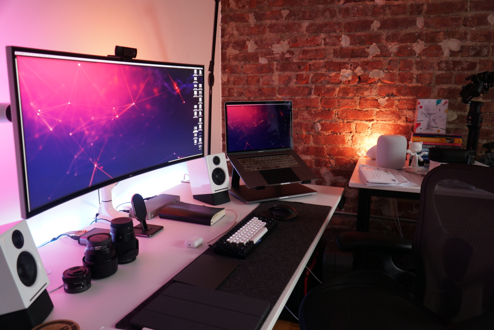

# Hello!

I’m Dale-Kurt a DevOps Engineer based in New York.

## What I’m working on

- Kubernetes cluster on Raspberry Pi 4(https://github.com/dalekurt/kubernetes-the-fun-way)

## WFH Setup

## Get in touch

- On Twitter [@dalekurt](https://www.twitter.com/dalekurt)
- On Instagram [@dalekurt](https://www.instagram.com/dalekurt)
- By email [hello@dalekurtmurray.com](mailto:hello@dalekurtmurray.com)
- On [LinkedIn](https://www.linkedin.com/in/dalekurtmurray/)
